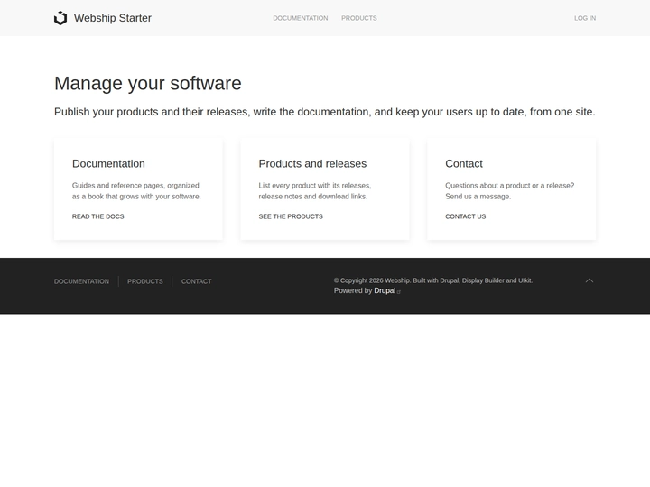

# Webship Starter

The Webship site template: a site to manage software, with documentation, products and releases,
a newsletter and social sharing. It brings the Webship 11.0.x distribution to recipes.

Maintained by [Webship](https://www.drupal.org/project/webship). Built with the
[UI Suite UIkit](https://www.drupal.org/project/ui_suite_uikit) theme, with [UIkit](https://getuikit.com) and
[HTMX](https://htmx.org), on top of Drupal and [Display Builder](https://www.drupal.org/project/display_builder).
No Layout Builder displays and no Drupal Canvas.

The site template works on its own: it applies the Web Admin, Web SEO, Web Security, Web Development, Web Page,
Web Assets, Web Editor, Web Config, Web Doc, Web Releases and Web Newsletter default recipes, the Web Dashboard
recipe and core recipes, never another site template.



## Install

Composer runs inside DDEV, so nothing is needed on your machine but DDEV itself. Start from the
[Website](https://www.drupal.org/project/website) project template, which ships this site template:

```shell
mkdir -p ~/workspace/projects/my-webship-site
cd ~/workspace/projects/my-webship-site
ddev config --project-type=drupal11 --docroot=web --php-version=8.4
ddev start
ddev composer create-project drupal/website:^1.0@alpha
ddev drush site:install ../recipes/webship_starter -y --account-name=webmaster --site-name="My Webship Site"
ddev launch
```

Or open the site with `ddev launch` and pick Webship Starter in the installer.

On an installed site, apply it as a recipe:

```shell
ddev composer require drupal/webship_starter:^1.0@alpha
ddev drush recipe ../recipes/webship_starter
```

## What you get

- **Content types**: Webpage, with the media library (images, documents, audio, video) of Web Assets.
- **A page layout** built in Display Builder with UIkit components: sticky navbar with logo, main and account
  menus, offcanvas menu on small screens, content section and footer with menus and social links.
- [Web Doc](https://www.drupal.org/project/webdoc): documentation book pages, with a Documentation page at `/docs`.
- [Web Releases](https://www.drupal.org/project/webreleases): products and release notes, at `/products`.
- [Web Newsletter](https://www.drupal.org/project/webnewsletter): a newsletter subscription webform.
- [Webshare](https://www.drupal.org/project/webshare): social sharing buttons.
- **Contact webform** with anti-spam protection, at `/contact`.
- **Administration**: [Web Admin](https://www.drupal.org/project/webadmin) with Gin and its toolbar, Coffee,
  Project Browser and automatic updates; the Webmaster and Editorial default dashboards of the
  [Web Dashboard recipe](https://www.drupal.org/project/webdash), built with Display Builder.
- **SEO and security**: [Web SEO](https://www.drupal.org/project/webseo) with breadcrumbs, redirects, path
  aliases, metatags and the XML sitemap; [Web Security](https://www.drupal.org/project/websecurity) with anti-spam
  protection and login by email or username.
- **Editing and configuration**: the editor and configuration management features of Webship.
- **Design system**: the UI Suite UIkit theme with its UI Styles utilities, UI Skins design tokens (light and
  dark color modes) and UI Icons pack.

## Requirements

- Drupal 11.4 or later.
- PHP 8.3 or later.
- Composer 2.

## Tests

```shell
yarn install
LAUNCH_URL=https://my-site.ddev.site yarn test
```
